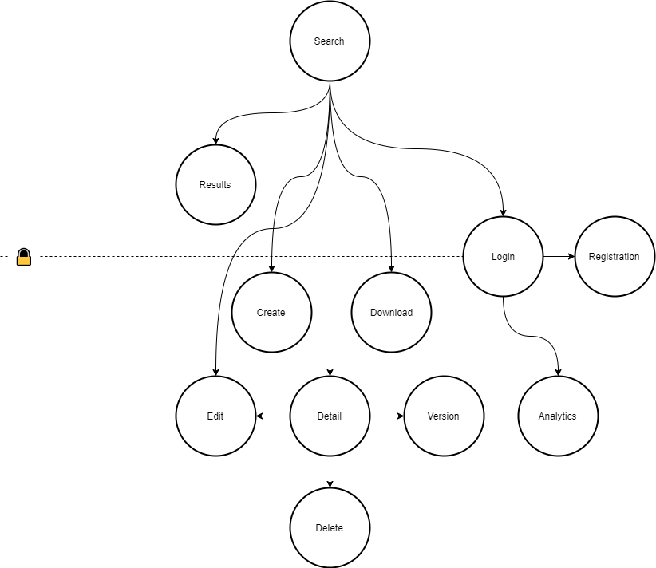
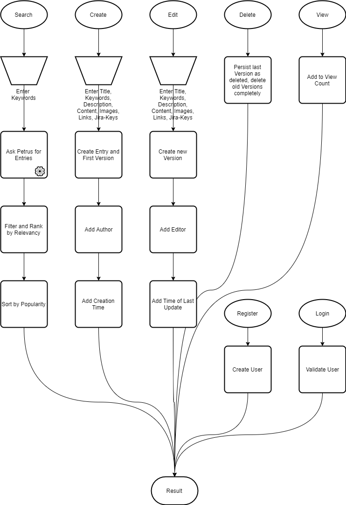
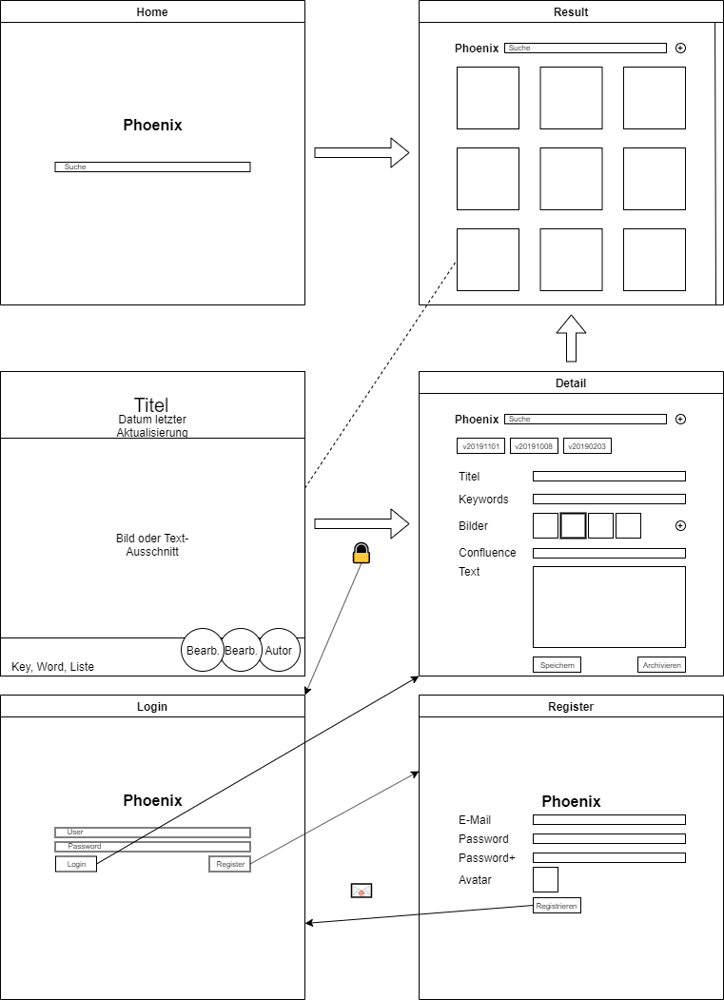

# phoenix

Neural Network Bulletin Board System using SciKit-Learn

_Alpha Phase_

## Purpose

Seamless Collection and Search of Tickets, Hotfixes, Patches and Mini-Documentations. With close ties to [Petrus](https://github.com/Skadisson/petrus) and it's logic. Using [Jira Service Desk](https://docs.atlassian.com/jira-servicedesk/REST/3.9.1/) and [Confluence](https://docs.atlassian.com/ConfluenceServer/rest/7.0.3/) APIs.

## Goals

Versioning of content, authors and editors. Referencing towards Jira, Git and Confluence - basically building a connecting hub between those worlds. Everything combined and sorted under three aspects: 

### Popularity

How frequented is the entity, commit, documentation or ticket?

### Context 

What similar entities, commits, documentations or tickets exist?

### Relevancy

How relevant are the entities to a search request, commit, documentation or ticket?

## UI Flow

## Flow diagram

## Wireframe

