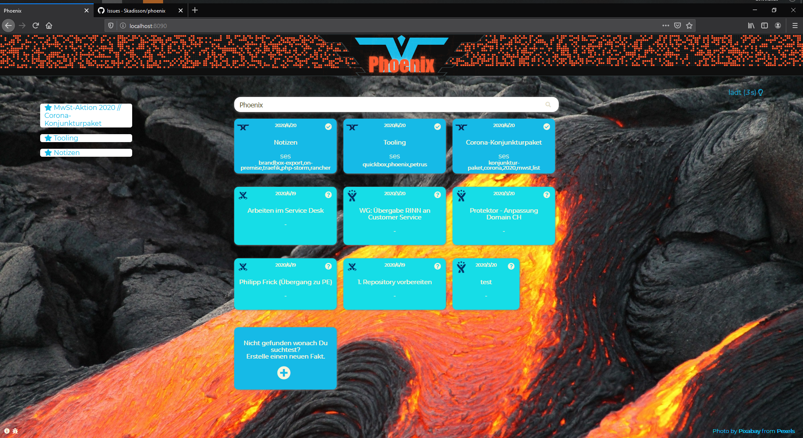

https://scikit-learn.org/stable/tutorial/text_analytics/working_with_text_data.html

# phoenix

Neural Network Bulletin Board System using SciKit-Learn

_Alpha Phase_

https://developer.atlassian.com/server/confluence/confluence-rest-api-examples/
https://developer.atlassian.com/cloud/jira/service-desk/rest/
https://docs.gitlab.com/ee/api/README.html

## Purpose

Seamless Collection and Search of Tickets, Hotfixes, Patches and Mini-Documentations. With close ties to [Petrus](https://github.com/Skadisson/petrus) and it's logic. Using [Jira Service Desk](https://docs.atlassian.com/jira-servicedesk/REST/3.9.1/) and [Confluence](https://docs.atlassian.com/ConfluenceServer/rest/7.0.3/) APIs.

## Goals

Versioning of content, authors and editors. Referencing towards Jira, Git and Confluence - basically building a connecting hub between those worlds. Everything combined and sorted under three aspects: 

### Popularity

How frequented is the entity, commit, documentation or ticket?

### Context 

What similar entities, commits, documentations or tickets exist?

### Relevancy

How relevant are the entities to a search request, commit, documentation or ticket?

## UI Flow

## Flow diagram

## Wireframe

___

pip list -l
<pre>
Package              Version
-------------------- -----------
atlassian-python-api 1.16.0
certifi              2020.6.20
chardet              3.0.4
httplib2             0.18.1
idna                 2.9
joblib               0.15.1
mkl-fft              1.0.15
mkl-random           1.1.0
mkl-service          2.3.0
numpy                1.19.0
oauth2               1.9.0.post1
oauthlib             3.1.0
pip                  20.0.2
pymongo              3.10.1
PyYAML               5.3
requests             2.24.0
requests-oauthlib    1.3.0
scikit-learn         0.23.1
scipy                1.5.0
setuptools           47.3.1
six                  1.15.0
threadpoolctl        2.1.0
tlslite              0.4.9
urllib3              1.25.9
Werkzeug             1.0.1
wheel                0.34.2
wincertstore         0.2
</pre>

Use "pip list --outdated --format=columns" to check for outdated versions.
